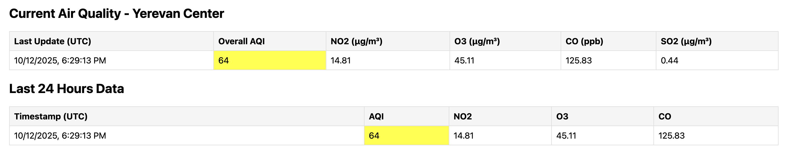

# Yerevan Air Quality Monitor

A real-time air quality monitoring web application for Yerevan, Armenia that polls Google Air Quality API and displays pollution data through a Flask web portal.

## 🚀 Live Deployment

The application is deployed on Render.com and available at:
**https://airpollutiongoogleapi.onrender.com/**

## Features

- **Real-time Monitoring**: Hourly polling of Google Air Quality API
- **Web Dashboard**: Live updating web interface with current and historical data
- **Data Export**: Download complete CSV dataset
- **Multiple Pollutants**: NO₂, O₃, CO, SO₂ monitoring
- **24-hour History**: View trends from the past day

## Pollutants Monitored
- **NO₂** - Nitrogen dioxide (μg/m³)
- **O₃** - Ozone (μg/m³)
- **CO** - Carbon monoxide (ppb)
- **SO₂** - Sulfur dioxide (μg/m³)
- **Overall AQI** - Universal Air Quality Index

