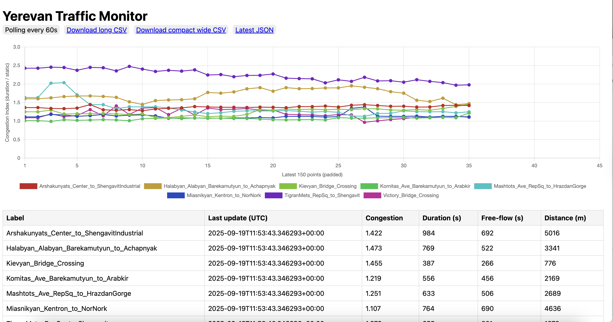

# Yerevan Traffic Monitor

This is a small Python/Flask app that retrieves route information from the Google Maps API and saves the data into CSV files.  
Each row in the CSV has the format:

- **congestion_index** = `duration / static_duration`  
- **duration** = current travel time with traffic  
- **static_duration** = baseline free-flow travel time  
- **distance** = route length in meters  

The app displays the congestion index on a simple web portal.

The portal is deployed on Google Cloud Run and can be accessed at:

👉 [https://yerevantrafficmonitor-578058838716.europe-west1.run.app/](https://yerevantrafficmonitor-578058838716.europe-west1.run.app/)

*(Currently suspended to avoid exhausting Google API free credits.)*

