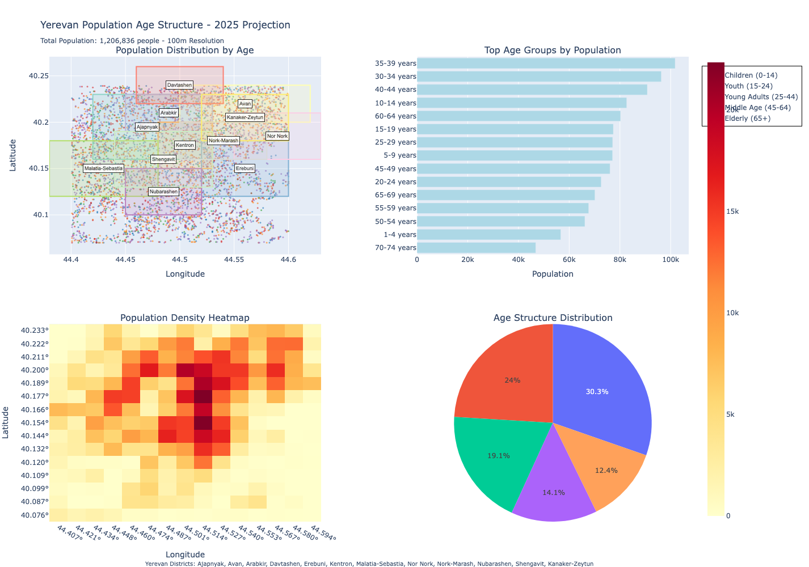

# Yerevan Population Analysis

This project analyzes population distribution and age structure in Yerevan, Armenia using WorldPop 2025 projection data.

## Project Overview

*Figure 1: Interactive dashboard showing population distribution across Yerevan districts*

## Features

- **Spatial Analysis**: 100m resolution population data
- **Age Structure**: 20 different age cohorts from 0 to 90+ years
- **Interactive Visualization**: Plotly-based dashboard with multiple views
- **District-level Analysis**: Data segmented across 12 Yerevan districts

## Data Sources

- WorldPop 2025 Population Projections
- 100m resolution raster data
- Age-structured population estimates
